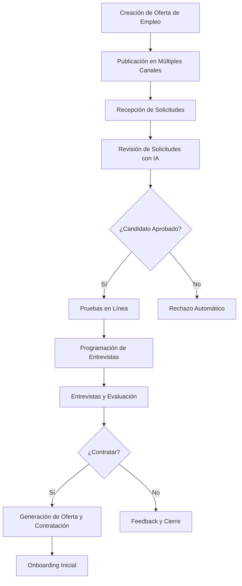
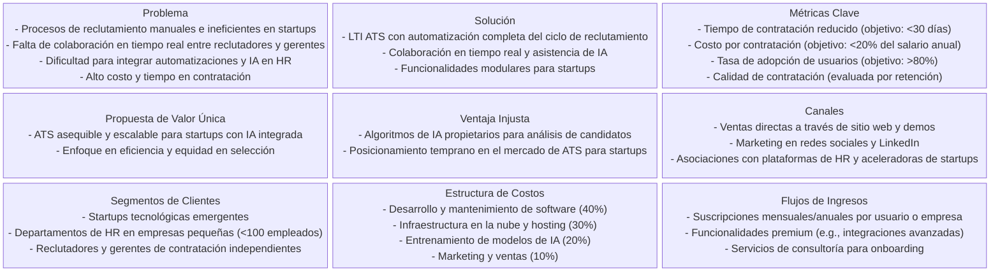

# Visión del Producto: LTI - Applicant Tracking System

## Descripción Breve del Software LTI

LTI es un sistema de seguimiento de candidatos (Applicant Tracking System - ATS) diseñado específicamente para startups emergentes que buscan optimizar sus procesos de reclutamiento y selección de talento. Como primera versión, LTI se enfoca en proporcionar una plataforma intuitiva y eficiente que automatiza las tareas rutinarias del departamento de Recursos Humanos, facilitando la colaboración en tiempo real entre reclutadores y gerentes de contratación. El sistema integra asistencia de inteligencia artificial para acelerar la evaluación de candidatos, reduciendo el tiempo de contratación y mejorando la calidad de las decisiones.

Esta versión inicial es realista al priorizar funcionalidades esenciales sin sobrecargar el sistema con características avanzadas que podrían complicar la implementación o aumentar los costos iniciales. Es competitiva al incorporar tendencias modernas como la automatización y la IA, diferenciándose de soluciones genéricas al adaptarse a las necesidades ágiles de una startup, donde la velocidad y la eficiencia son críticas.

## Valor Añadido y Ventajas Competitivas

El valor añadido de LTI radica en su capacidad para transformar el proceso de reclutamiento de una actividad manual y fragmentada en un flujo de trabajo integrado y automatizado. Al aumentar la eficiencia de los departamentos de HR, LTI permite a las startups dedicar más tiempo a estrategias de crecimiento en lugar de tareas administrativas. La mejora en la colaboración en tiempo real reduce los silos entre reclutadores y gerentes, asegurando una toma de decisiones más informada y rápida. La incorporación de automatizaciones, como la publicación automática en múltiples canales y la programación inteligente de entrevistas, minimiza errores humanos y acelera el ciclo de contratación. Finalmente, la integración de asistencia de IA en tareas clave, como el análisis de currículos y la predicción de ajuste cultural, proporciona una ventaja competitiva al identificar candidatos de alta calidad con mayor precisión que los métodos tradicionales.

Las ventajas competitivas de LTI incluyen:
- **Escalabilidad**: Diseñado para startups, el sistema puede crecer con la empresa sin requerir migraciones costosas.
- **Costo-efectividad**: Al enfocarse en un MVP (Producto Mínimo Viable), reduce los costos de desarrollo inicial y permite iteraciones rápidas basadas en feedback real.
- **Innovación con IA**: La asistencia de IA no solo acelera procesos, sino que también mejora la equidad en la selección al reducir sesgos inconscientes.
- **Interfaz intuitiva**: Una experiencia de usuario simplificada asegura adopción rápida, incluso en equipos no técnicos.
- **Integración nativa**: Soporte para publicación en múltiples plataformas, facilitando el alcance global sin herramientas adicionales.

Estas decisiones se justifican por el análisis de mercado de ATS como Greenhouse, Workday y Lever, donde las startups priorizan soluciones asequibles y ágiles. LTI se posiciona como una alternativa accesible, evitando la complejidad de sistemas enterprise que no se adaptan a entornos dinámicos.

## Explicación de las Funciones Principales

LTI incorpora siete funcionalidades básicas que cubren el ciclo completo de reclutamiento, desde la creación de ofertas hasta la contratación. Cada función está diseñada para ser modular, permitiendo expansiones futuras, y se justifica por su alineación con las mejores prácticas de HR en startups: eficiencia, colaboración y automatización.

1. **Creación de Ofertas de Empleo**: Permite a los reclutadores definir perfiles de puestos con campos estructurados (título, descripción, requisitos, salario). Esta función incluye plantillas predefinidas para acelerar el proceso y asegurar consistencia. Justificación: Reduce el tiempo de redacción manual y facilita la colaboración al permitir revisiones en tiempo real.

2. **Publicación en Portales de Empleo, Sitios Web y Redes Sociales**: Automatiza la distribución de ofertas a múltiples canales (LinkedIn, Indeed, sitio web corporativo). Incluye integración con APIs de plataformas populares para una publicación simultánea. Justificación: Maximiza el alcance de candidatos sin esfuerzo manual, aumentando la eficiencia y reduciendo costos de marketing.

3. **Recepción de Solicitudes de Empleo**: Centraliza las aplicaciones entrantes en un repositorio único, con parsing automático de currículos para extraer datos clave (experiencia, habilidades). Justificación: Elimina la gestión manual de correos electrónicos y formularios, mejorando la organización y permitiendo búsquedas rápidas.

4. **Revisión de Solicitudes**: Proporciona herramientas para filtrar y calificar candidatos, con asistencia de IA para resúmenes automáticos y puntuaciones de ajuste. Incluye colaboración en tiempo real para comentarios compartidos. Justificación: Acelera la revisión inicial, reduciendo el sesgo humano y facilitando decisiones colectivas entre reclutadores y gerentes.

5. **Realización de Pruebas en Línea**: Integra evaluaciones automatizadas (pruebas de habilidades, cuestionarios) con resultados instantáneos. Soporta integración con plataformas externas como HackerRank. Justificación: Permite evaluaciones objetivas y escalables, liberando tiempo para entrevistas cualitativas.

6. **Programación de Entrevistas**: Herramienta de calendario integrada para agendar entrevistas, con notificaciones automáticas y sincronización con herramientas como Google Calendar. Incluye recordatorios y confirmaciones. Justificación: Mejora la coordinación entre partes interesadas, reduciendo no-shows y optimizando el tiempo de todos los involucrados.

7. **Contratación de Candidatos Seleccionados**: Finaliza el proceso con generación automática de ofertas de empleo, seguimiento de aceptación y onboarding inicial. Justificación: Cierra el ciclo de manera eficiente, asegurando una transición suave y recopilando datos para mejorar futuros procesos.

## Diagrama del Proceso de Reclutamiento en LTI

A continuación, se presenta un diagrama de flujo que ilustra el proceso completo de reclutamiento en LTI, destacando las funcionalidades principales y la integración de automatizaciones y IA.

Este diagrama justifica la estructura secuencial del sistema, asegurando un flujo lógico que minimiza cuellos de botella y maximiza la colaboración. La inclusión de decisiones automatizadas (como rechazos) y asistencia de IA refleja el enfoque en eficiencia y competitividad.

## Lean Canvas del Modelo de Negocio

Para comprender y validar el modelo de negocio de LTI, se presenta un Lean Canvas adaptado al contexto de una startup en el sector de Recursos Humanos. Este diagrama resume los elementos clave del negocio, incluyendo problemas, soluciones, métricas y fuentes de ingresos, basándose en el análisis de mercado y las funcionalidades definidas. Las decisiones se justifican por la necesidad de un enfoque lean que priorice la viabilidad financiera y la escalabilidad para startups, evitando inversiones excesivas en características no esenciales.

Este Lean Canvas se justifica por su alineación con el marco de Lean Startup, permitiendo iteraciones rápidas basadas en métricas reales. Los segmentos de clientes se enfocan en startups para maximizar el retorno de inversión inicial, mientras que los flujos de ingresos priorizan modelos SaaS recurrentes para sostenibilidad financiera.