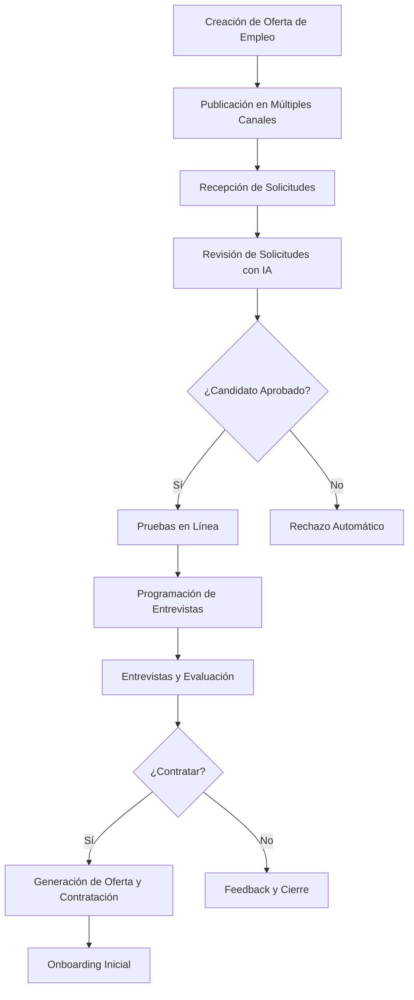
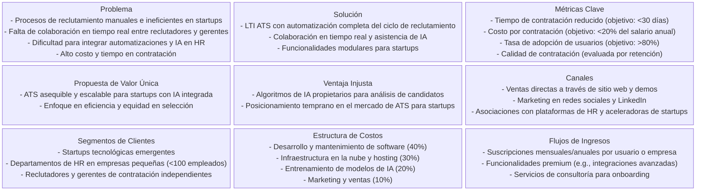
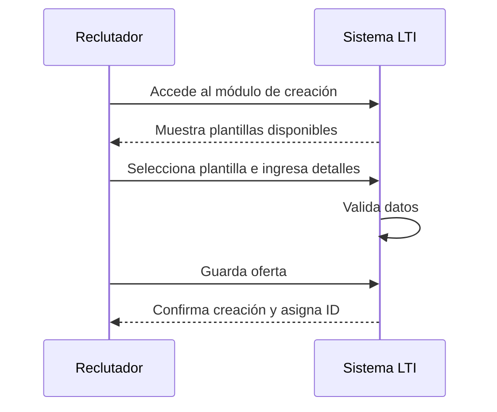
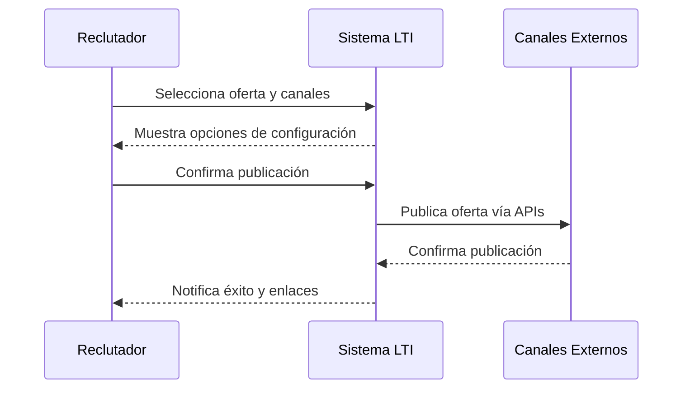
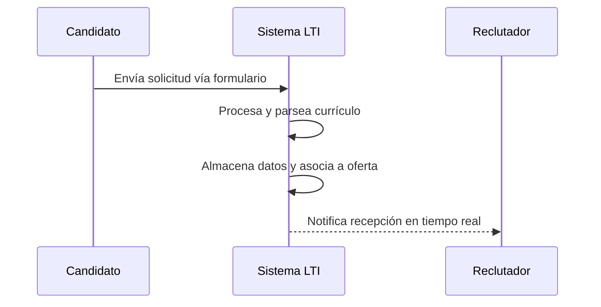
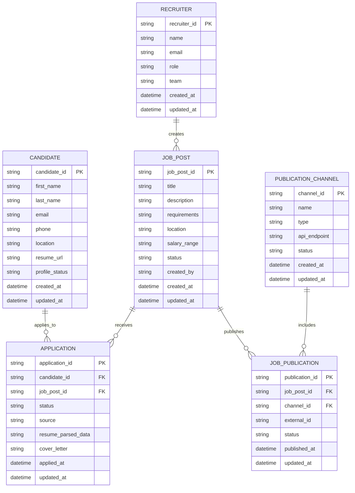
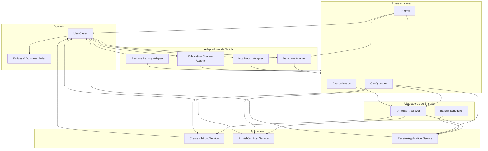

# Visión del Producto: LTI - Applicant Tracking System

## Descripción Breve del Software LTI

LTI es un sistema de seguimiento de candidatos (Applicant Tracking System - ATS) diseñado específicamente para startups emergentes que buscan optimizar sus procesos de reclutamiento y selección de talento. Como primera versión, LTI se enfoca en proporcionar una plataforma intuitiva y eficiente que automatiza las tareas rutinarias del departamento de Recursos Humanos, facilitando la colaboración en tiempo real entre reclutadores y gerentes de contratación. El sistema integra asistencia de inteligencia artificial para acelerar la evaluación de candidatos, reduciendo el tiempo de contratación y mejorando la calidad de las decisiones.

Esta versión inicial es realista al priorizar funcionalidades esenciales sin sobrecargar el sistema con características avanzadas que podrían complicar la implementación o aumentar los costos iniciales. Es competitiva al incorporar tendencias modernas como la automatización y la IA, diferenciándose de soluciones genéricas al adaptarse a las necesidades ágiles de una startup, donde la velocidad y la eficiencia son críticas.

## Valor Añadido y Ventajas Competitivas

El valor añadido de LTI radica en su capacidad para transformar el proceso de reclutamiento de una actividad manual y fragmentada en un flujo de trabajo integrado y automatizado. Al aumentar la eficiencia de los departamentos de HR, LTI permite a las startups dedicar más tiempo a estrategias de crecimiento en lugar de tareas administrativas. La mejora en la colaboración en tiempo real reduce los silos entre reclutadores y gerentes, asegurando una toma de decisiones más informada y rápida. La incorporación de automatizaciones, como la publicación automática en múltiples canales y la programación inteligente de entrevistas, minimiza errores humanos y acelera el ciclo de contratación. Finalmente, la integración de asistencia de IA en tareas clave, como el análisis de currículos y la predicción de ajuste cultural, proporciona una ventaja competitiva al identificar candidatos de alta calidad con mayor precisión que los métodos tradicionales.

Las ventajas competitivas de LTI incluyen:
- **Escalabilidad**: Diseñado para startups, el sistema puede crecer con la empresa sin requerir migraciones costosas.
- **Costo-efectividad**: Al enfocarse en un MVP (Producto Mínimo Viable), reduce los costos de desarrollo inicial y permite iteraciones rápidas basadas en feedback real.
- **Innovación con IA**: La asistencia de IA no solo acelera procesos, sino que también mejora la equidad en la selección al reducir sesgos inconscientes.
- **Interfaz intuitiva**: Una experiencia de usuario simplificada asegura adopción rápida, incluso en equipos no técnicos.
- **Integración nativa**: Soporte para publicación en múltiples plataformas, facilitando el alcance global sin herramientas adicionales.

Estas decisiones se justifican por el análisis de mercado de ATS como Greenhouse, Workday y Lever, donde las startups priorizan soluciones asequibles y ágiles. LTI se posiciona como una alternativa accesible, evitando la complejidad de sistemas enterprise que no se adaptan a entornos dinámicos.

## Explicación de las Funciones Principales

LTI incorpora siete funcionalidades básicas que cubren el ciclo completo de reclutamiento, desde la creación de ofertas hasta la contratación. Cada función está diseñada para ser modular, permitiendo expansiones futuras, y se justifica por su alineación con las mejores prácticas de HR en startups: eficiencia, colaboración y automatización.

1. **Creación de Ofertas de Empleo**: Permite a los reclutadores definir perfiles de puestos con campos estructurados (título, descripción, requisitos, salario). Esta función incluye plantillas predefinidas para acelerar el proceso y asegurar consistencia. Justificación: Reduce el tiempo de redacción manual y facilita la colaboración al permitir revisiones en tiempo real.

2. **Publicación en Portales de Empleo, Sitios Web y Redes Sociales**: Automatiza la distribución de ofertas a múltiples canales (LinkedIn, Indeed, sitio web corporativo). Incluye integración con APIs de plataformas populares para una publicación simultánea. Justificación: Maximiza el alcance de candidatos sin esfuerzo manual, aumentando la eficiencia y reduciendo costos de marketing.

3. **Recepción de Solicitudes de Empleo**: Centraliza las aplicaciones entrantes en un repositorio único, con parsing automático de currículos para extraer datos clave (experiencia, habilidades). Justificación: Elimina la gestión manual de correos electrónicos y formularios, mejorando la organización y permitiendo búsquedas rápidas.

4. **Revisión de Solicitudes**: Proporciona herramientas para filtrar y calificar candidatos, con asistencia de IA para resúmenes automáticos y puntuaciones de ajuste. Incluye colaboración en tiempo real para comentarios compartidos. Justificación: Acelera la revisión inicial, reduciendo el sesgo humano y facilitando decisiones colectivas entre reclutadores y gerentes.

5. **Realización de Pruebas en Línea**: Integra evaluaciones automatizadas (pruebas de habilidades, cuestionarios) con resultados instantáneos. Soporta integración con plataformas externas como HackerRank. Justificación: Permite evaluaciones objetivas y escalables, liberando tiempo para entrevistas cualitativas.

6. **Programación de Entrevistas**: Herramienta de calendario integrada para agendar entrevistas, con notificaciones automáticas y sincronización con herramientas como Google Calendar. Incluye recordatorios y confirmaciones. Justificación: Mejora la coordinación entre partes interesadas, reduciendo no-shows y optimizando el tiempo de todos los involucrados.

7. **Contratación de Candidatos Seleccionados**: Finaliza el proceso con generación automática de ofertas de empleo, seguimiento de aceptación y onboarding inicial. Justificación: Cierra el ciclo de manera eficiente, asegurando una transición suave y recopilando datos para mejorar futuros procesos.

## Diagrama del Proceso de Reclutamiento en LTI

A continuación, se presenta un diagrama de flujo que ilustra el proceso completo de reclutamiento en LTI, destacando las funcionalidades principales y la integración de automatizaciones y IA.

Este diagrama justifica la estructura secuencial del sistema, asegurando un flujo lógico que minimiza cuellos de botella y maximiza la colaboración. La inclusión de decisiones automatizadas (como rechazos) y asistencia de IA refleja el enfoque en eficiencia y competitividad.

## Lean Canvas del Modelo de Negocio

Para comprender y validar el modelo de negocio de LTI, se presenta un Lean Canvas adaptado al contexto de una startup en el sector de Recursos Humanos. Este diagrama resume los elementos clave del negocio, incluyendo problemas, soluciones, métricas y fuentes de ingresos, basándose en el análisis de mercado y las funcionalidades definidas. Las decisiones se justifican por la necesidad de un enfoque lean que priorice la viabilidad financiera y la escalabilidad para startups, evitando inversiones excesivas en características no esenciales.

Este Lean Canvas se justifica por su alineación con el marco de Lean Startup, permitiendo iteraciones rápidas basadas en métricas reales. Los segmentos de clientes se enfocan en startups para maximizar el retorno de inversión inicial, mientras que los flujos de ingresos priorizan modelos SaaS recurrentes para sostenibilidad financiera.

## Casos de Uso Principales

A continuación, se documentan los tres casos de uso principales de LTI, correspondientes a las primeras etapas del proceso de reclutamiento. Cada caso de uso se describe en formato estructurado, incluyendo actores, precondiciones, flujo principal, postcondiciones y justificaciones. Se incluye un diagrama Mermaid para ilustrar el flujo de cada caso de uso, facilitando la comprensión visual y la validación del diseño.

### Caso de Uso 1: Creación de Ofertas de Empleo

**Descripción**: Este caso de uso permite a un reclutador crear una nueva oferta de empleo en el sistema LTI, utilizando plantillas predefinidas y campos estructurados para asegurar consistencia y eficiencia.

**Actores**:
- Reclutador (usuario principal)

**Precondiciones**:
- El reclutador debe estar autenticado en el sistema LTI.
- El sistema debe tener acceso a plantillas de ofertas de empleo.

**Flujo Principal**:
1. El reclutador accede al módulo de creación de ofertas.
2. Selecciona una plantilla de oferta o inicia una nueva.
3. Ingresa los detalles: título, descripción, requisitos, salario, ubicación.
4. El sistema valida los datos ingresados.
5. El reclutador guarda la oferta.
6. El sistema confirma la creación y asigna un ID único a la oferta.

**Postcondiciones**:
- La oferta de empleo se almacena en la base de datos y está disponible para publicación.
- Se registra un log de auditoría para trazabilidad.

**Justificación**: Esta funcionalidad se justifica por la necesidad de estandarizar la creación de ofertas, reduciendo errores manuales y acelerando el proceso. La inclusión de plantillas facilita la adopción por usuarios no expertos, alineándose con el enfoque en eficiencia para startups.

**Diagrama**:

### Caso de Uso 2: Publicación en Portales de Empleo, Sitios Web y Redes Sociales

**Descripción**: Este caso de uso permite al reclutador publicar una oferta de empleo creada en múltiples canales externos, automatizando la distribución para maximizar el alcance.

**Actores**:
- Reclutador (usuario principal)

**Precondiciones**:
- La oferta de empleo debe estar creada y aprobada en el sistema.
- El sistema debe tener configuradas integraciones con APIs de portales (e.g., LinkedIn, Indeed).

**Flujo Principal**:
1. El reclutador selecciona una oferta existente.
2. Elige los canales de publicación (portales, sitio web, redes sociales).
3. Configura opciones adicionales (fechas, mensajes personalizados).
4. El sistema valida las credenciales de los canales.
5. El reclutador confirma la publicación.
6. El sistema publica automáticamente en los canales seleccionados y registra el estado.

**Postcondiciones**:
- La oferta se publica en los canales especificados.
- Se actualiza el estado de la oferta en el sistema (publicada).
- Se envía una notificación al reclutador con enlaces a las publicaciones.

**Justificación**: La automatización de la publicación reduce el tiempo y esfuerzo manual, permitiendo a las startups competir con empresas más grandes en alcance. La integración con múltiples canales se justifica por la diversidad de fuentes de candidatos en el mercado actual, optimizando la eficiencia del reclutamiento.

**Diagrama**:

### Caso de Uso 3: Recepción de Solicitudes de Empleo

**Descripción**: Este caso de uso permite al sistema recibir y procesar solicitudes de empleo enviadas por candidatos a través de formularios en línea o correos electrónicos, centralizándolas en el repositorio de LTI.

**Actores**:
- Candidato (usuario externo)
- Sistema LTI (procesa automáticamente)

**Precondiciones**:
- La oferta de empleo debe estar publicada y activa.
- El sistema debe tener formularios de aplicación configurados.

**Flujo Principal**:
1. El candidato accede al formulario de aplicación (desde un portal o sitio web).
2. Ingresa sus datos personales, currículo y carta de presentación.
3. Envía la solicitud.
4. El sistema recibe la solicitud y realiza parsing automático del currículo.
5. Extrae datos clave (experiencia, habilidades) y los almacena.
6. Asigna la solicitud a la oferta correspondiente y notifica al reclutador.

**Postcondiciones**:
- La solicitud se almacena en la base de datos asociada a la oferta.
- El reclutador recibe una notificación en tiempo real.
- Se genera un perfil de candidato para revisión posterior.

**Justificación**: Centralizar las solicitudes elimina la gestión manual de correos y formularios, mejorando la organización y permitiendo búsquedas eficientes. El parsing automático con IA se justifica por la necesidad de procesar grandes volúmenes de aplicaciones en startups, reduciendo el tiempo de respuesta y mejorando la calidad de los datos.

**Diagrama**:

## Modelo de Datos del Sistema LTI

A continuación se describe el modelo de datos de las entidades principales del ATS LTI, con sus atributos esenciales y las relaciones más relevantes. Este modelo facilita la implementación técnica del sistema y asegura consistencia entre los casos de uso y el comportamiento esperado.

### Entidades principales

- **CANDIDATE**: Representa al candidato que aplica a ofertas. Incluye información personal, un enlace al currículo y el estado del perfil. Esta entidad es clave para la centralización de solicitudes y la evaluación posterior.
- **JOB_POST**: Define la oferta de empleo creada por el reclutador. Contiene los campos necesarios para publicación y seguimiento, tales como título, descripción, requisitos, ubicación y estado.
- **APPLICATION**: Registra cada postulación de un candidato a una oferta. Incluye referencias (FK) a `CANDIDATE` y `JOB_POST`, el estado actual de la aplicación y los datos extraídos tras el procesamiento del currículo.
- **RECRUITER**: Modela al usuario interno responsable de crear ofertas y gestionar postulaciones. Incluye datos de contacto y el equipo al que pertenece.
- **PUBLICATION_CHANNEL**: Representa los canales externos donde se publica una oferta (LinkedIn, Indeed, sitio web, redes sociales). Incluye información técnica para integraciones API.
- **JOB_PUBLICATION**: Materializa la publicación de una oferta en un canal externo. Guarda el estado de la publicación y el identificador externo proporcionado por el canal.

### Otras entidades importantes

- **INTERVIEW**: Para una versión posterior, almacena agendas de entrevistas, participantes, resultados y estados de programación.
- **ASSESSMENT**: Registra pruebas en línea, cuestionarios y resultados de evaluación técnica vinculados a postulantes.
- **OFFER**: Modela ofertas de contrato generadas para candidatos finalistas, incluyendo condiciones propuestas, fecha de vencimiento y estado de aceptación.
- **ACTIVITY_LOG**: Registra acciones del sistema y del usuario para auditoría y trazabilidad, como creación de ofertas, publicaciones, actualizaciones de estado y notificaciones.
- **NOTIFICATION**: Gestiona los mensajes y alertas enviados a reclutadores, candidatos y otros actores, garantizando trazabilidad y reenvío si es necesario.
- **USER**: Si se requiere un modelo de autenticación más general, agrupa reclutadores, hiring managers y otros perfiles con permisos y credenciales.

Este modelo de datos se enfoca en la primera versión de LTI, permitiendo una implementación inicial robusta y extendible. Las entidades adicionales propuestas son críticas para evolucionar el ATS hacia funcionalidades de entrevistas, evaluaciones y ofertas formales.

## Diseño de Arquitectura a Alto Nivel para LTI-XVB

### Evaluación de opciones de arquitectura

1. **Arquitectura Monolítica Tradicional**
   - Ventajas: implementación rápida, despliegue sencillo, menor complejidad inicial.
   - Riesgos: puede generar acoplamientos fuertes y dificultar la escalabilidad futura.
   - Adecuación: válida para un MVP, pero limitada si se quiere evolucionar con microservicios.

2. **Arquitectura basada en Microservicios**
   - Ventajas: escalabilidad independiente de componentes, despliegue modular y resiliencia.
   - Riesgos: alta complejidad operacional, necesidad de infraestructura madura y mayor costo inicial.
   - Adecuación: excesiva para la primera versión y contraria al objetivo de no sobreingeniería.

3. **Arquitectura Hexagonal Modular (Ports and Adapters)**
   - Ventajas: separa el dominio central de las dependencias externas, facilita pruebas y evolución.
   - Riesgos: requiere disciplina en diseño, pero mantiene simplicidad si se aplica con pragmatismo.
   - Adecuación: la mejor opción para LTI-XVB, porque equilibra una implementación clara y una evolución futura segura.

### Propuesta seleccionada

Para el lanzamiento inicial de LTI-XVB se propone una **arquitectura hexagonal modular** implementada como un monolito bien delimitado. Esta opción permite comenzar con una base simple y ordenada, mientras se protege el dominio del negocio de cambios en las infraestructuras externas. Evita la sobreingeniería de microservicios y, a su vez, no limita la escalabilidad futura porque los adaptadores externos pueden evolucionar de forma independiente.

### Diseño de alto nivel con Arquitectura Hexagonal

El sistema se organiza en capas:

- **Dominio**: contiene las entidades principales (`Candidate`, `JobPost`, `Application`, `Recruiter`, `PublicationChannel`, `JobPublication`) y las reglas de negocio. Aquí se definen los casos de uso, las validaciones y las políticas de negocio.
- **Aplicación**: orquesta los casos de uso, gestiona transacciones y expone puertos internos para interactuar con el dominio.
- **Adaptadores de entrada**: interfaces que permiten recibir solicitudes externas, como una API REST, un panel web para reclutadores y procesos batch de importación de datos.
- **Adaptadores de salida**: interfaces que conectan el dominio con infraestructuras externas, como la base de datos, el servicio de notificaciones, las APIs de publicación en portales y el motor de parsing de currículos.
- **Infraestructura**: implementa los adaptadores de salida y las utilidades transversales (persistencia, mensajería, logging, autenticación).

### Detalle del diseño

- El **core del dominio** debe ser independiente de cualquier tecnología específica. Las entidades y casos de uso solo dependen de interfaces (puertos). Esto facilita testes unitarios y cambios en la infraestructura sin afectar la lógica central.
- Los **casos de uso** principales se modelan como servicios de aplicación: `CreateJobPost`, `PublishJobPost`, `ReceiveApplication`. Cada servicio recibe datos desde un adaptador de entrada y usa puertos de salida para persistencia y comunicación externa.
- El **adaptador REST** expone los endpoints necesarios para el panel de administración y el consumo de APIs internas. Para la primera versión, un único servicio HTTP es suficiente.
- La **persistencia** se maneja mediante un adaptador de salida hacia una base de datos relacional o document store. El diseño permite cambiar la implementación sin alterar el dominio.
- Las **integraciones externas** se abstraen tras puertos como `JobPublicationGateway` y `ResumeParsingGateway`, de modo que el dominio no conoce detalles de APIs de LinkedIn, Indeed u otros servicios.
- El **módulo de notificaciones** se implementa como adaptador de salida, con capacidad de enviar emails, notificaciones internas o eventos a un bus ligero.
- La **infraestructura** debe contener un componente de configuración y un runner de la aplicación que ensambla los adaptadores y expone los puertos.

### Ventajas concretas de la implementación

- Facilita el desarrollo iterativo del MVP.
- Permite añadir nuevas integraciones sin modificar la lógica de negocio.
- Proporciona una base sólida para escalar por módulos cuando la carga lo requiera.
- Reduce el riesgo de que cambios en el frontend o en los proveedores de publicación afecten el núcleo del ATS.

### Diagrama del diseño del sistema

Este diseño balancea una primera ejecución rápida con la capacidad de crecer de forma ordenada. La arquitectura hexagonal asegura que el dominio de LTI permanezca limpio y adaptable, permitiendo a la startup iterar sobre funcionalidades sin comprometer la flexibilidad técnica.